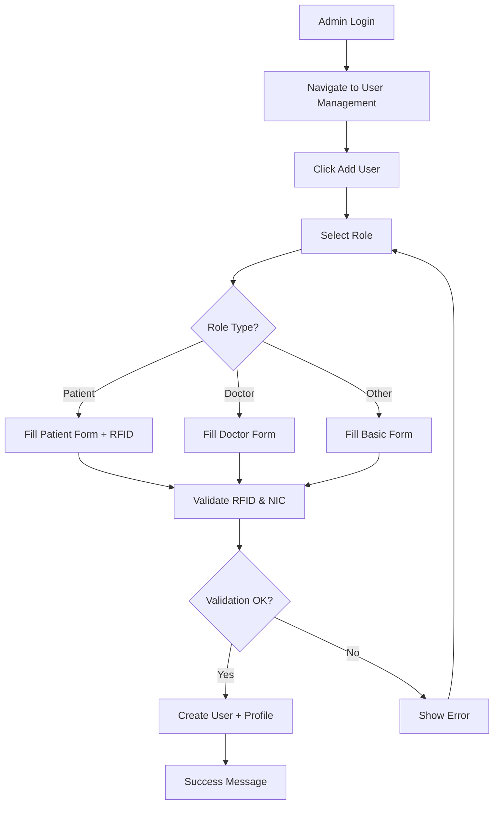

# User Registration & RFID Implementation Guide

## 🎯 Overview

MediVault implements **admin-controlled user registration** with **mandatory RFID tags for all patients**. This document explains the complete registration workflow.

## 🔒 Registration Policy

### Key Requirements:

1. **Admin-Only Registration**: Users CANNOT self-register. Only admins can create accounts.
2. **RFID Mandatory for Patients**: Every patient MUST have a unique RFID tag assigned during registration.
3. **Role-Specific Data**: Different user roles require different information during registration.

## 📋 Registration Process

### Step 1: Admin Login

1. Login to MediVault as an admin user
2. Navigate to **User Management** from the sidebar
3. Click the **"Add User"** button

### Step 2: Select User Role

Available roles:

- **Patient** - Requires NIC and RFID
- **Doctor** - Requires specialization and license
- **Pharmacist** - Requires license number
- **Lab Technician** - Requires certification number
- **Admin** - Basic account only

### Step 3: Fill Required Information

#### For ALL Users:

- Username (required)
- Password (required)
- Email (optional but recommended)
- First Name
- Last Name
- Role (required)

#### Additional for PATIENTS (Required):

- **RFID Tag** (MANDATORY) - Format: RF123456
- **NIC** (National Identity Card) - Format: 123456789V
- Date of Birth
- Gender (Male/Female/Other)
- Contact Information (Phone)
- Address
- Blood Type (A+, A-, B+, B-, AB+, AB-, O+, O-)
- Allergies

#### Additional for DOCTORS (Required):

- **Specialization** (e.g., Cardiology, Neurology)
- **License Number** (e.g., MD12345)
- Qualifications (e.g., MBBS, MD)
- Years of Experience

#### Additional for PHARMACISTS (Required):

- **License Number** (e.g., PH12345)

#### Additional for LAB TECHNICIANS (Required):

- **Certification Number** (e.g., LT12345)

### Step 4: Validation & Creation

The system validates:

- Username uniqueness
- Password strength
- Required fields per role
- RFID uniqueness (for patients)
- NIC uniqueness (for patients)

Upon successful validation:

1. User account is created with hashed password
2. Role-specific profile is created automatically
3. Success notification is displayed
4. User appears in the management table

## 🏷️ RFID Implementation

### What is RFID?

Radio-Frequency Identification (RFID) tags are used to uniquely identify patients throughout the hospital system.

### RFID Usage in MediVault:

- **Patient Identification**: Quick patient lookup via RFID scanner
- **Appointment Check-in**: Automated check-in using RFID
- **Medical Records Access**: Fast retrieval of patient history
- **Prescription Fulfillment**: Verify patient identity at pharmacy
- **Lab Test Processing**: Link test samples to correct patient

### RFID Format:

- Recommended format: `RF` + 6-digit number (e.g., `RF123456`)
- Must be unique across all patients
- Stored in database `patients.rfid` column
- Can be scanned using RFID readers integrated with MediVault

### RFID Workflow Example:

```
1. Patient arrives at hospital
2. Staff scans RFID tag at reception
3. System retrieves patient profile automatically
4. Displays: Name, Photo, Medical History, Allergies
5. Creates/updates appointment record
6. Patient proceeds to doctor
```

## 🔍 API Endpoints

### Create User (Admin Only)

```http
POST /api/admin/users
Authorization: Admin session required

Request Body:
{
  "username": "john.doe",
  "password": "SecurePass123!",
  "email": "john@example.com",
  "firstName": "John",
  "lastName": "Doe",
  "role": "patient",
  "patientData": {
    "nic": "123456789V",
    "rfid": "RF123456",        // REQUIRED FOR PATIENTS
    "dateOfBirth": "1990-01-15",
    "gender": "male",
    "contactInfo": "+94771234567",
    "address": "123 Main St, Colombo",
    "bloodType": "O+",
    "allergies": "Penicillin"
  }
}

Response (201 Created):
{
  "id": "uuid-here",
  "username": "john.doe",
  "email": "john@example.com",
  "firstName": "John",
  "lastName": "Doe",
  "role": "patient",
  "createdAt": "2024-01-15T10:30:00Z"
}
```

### Example: Create Doctor

```json
{
  "username": "dr.smith",
  "password": "DoctorPass123!",
  "email": "smith@hospital.com",
  "firstName": "Sarah",
  "lastName": "Smith",
  "role": "doctor",
  "doctorData": {
    "specialization": "Cardiology",
    "licenseNumber": "MD12345",
    "qualifications": "MBBS, MD Cardiology",
    "experience": 10
  }
}
```

## 🎨 UI Components

### Add User Dialog

Located in: `client/src/pages/admin-users.tsx`

**Features:**

- Dynamic form fields based on selected role
- Real-time validation
- Role-specific sections (collapsible)
- RFID input with format hint for patients
- Blood type dropdown
- Gender selection
- Date picker for DOB
- Loading state during submission
- Clear error messages

**RFID Input Field:**

```tsx
<Label htmlFor="add-rfid">RFID *</Label>
<Input
  id="add-rfid"
  value={addForm.rfid}
  onChange={(e) => setAddForm({ ...addForm, rfid: e.target.value })}
  placeholder="RF123456"
  required
/>
```

## 📊 Database Schema

### Users Table

```sql
CREATE TABLE users (
  id VARCHAR PRIMARY KEY DEFAULT gen_random_uuid(),
  username VARCHAR UNIQUE NOT NULL,
  password VARCHAR NOT NULL,  -- bcrypt hashed
  email VARCHAR UNIQUE,
  first_name VARCHAR,
  last_name VARCHAR,
  role VARCHAR NOT NULL,  -- 'patient' | 'doctor' | 'pharmacist' | 'lab_technician' | 'admin'
  created_at TIMESTAMP DEFAULT NOW(),
  updated_at TIMESTAMP DEFAULT NOW()
);
```

### Patients Table

```sql
CREATE TABLE patients (
  id VARCHAR PRIMARY KEY DEFAULT gen_random_uuid(),
  user_id VARCHAR NOT NULL REFERENCES users(id),
  nic VARCHAR UNIQUE NOT NULL,
  rfid VARCHAR UNIQUE NOT NULL,  -- MANDATORY RFID TAG
  health_id VARCHAR UNIQUE,
  date_of_birth TIMESTAMP,
  gender VARCHAR,
  contact_info VARCHAR,
  address TEXT,
  blood_type VARCHAR,
  allergies TEXT,
  created_at TIMESTAMP DEFAULT NOW(),
  updated_at TIMESTAMP DEFAULT NOW()
);
```

## ✅ Validation Rules

### Username:

- Required
- Unique across all users
- Alphanumeric with dots/underscores allowed
- Min length: 3 characters

### Password:

- Required
- Min length: 8 characters (recommended)
- Hashed with bcrypt before storage

### Patient RFID:

- **Required** for all patients
- Must be unique
- Recommended format: RF + 6 digits
- Cannot be changed after creation (for audit trail)

### Patient NIC:

- **Required** for all patients
- Must be unique
- Format: 9 digits + letter (Sri Lankan format)

### Doctor License:

- **Required** for all doctors
- Must be unique
- Alphanumeric

## 🚨 Error Handling

Common errors and solutions:

### "Username already exists"

- Choose a different username
- Check existing users table

### "RFID already assigned"

- This RFID is already linked to another patient
- Verify the RFID tag number
- Use a unique RFID tag

### "NIC already registered"

- Patient with this NIC already exists
- Check if patient already has an account
- Update existing patient instead

### "Password required"

- Password field cannot be empty
- Minimum 8 characters recommended

## 🔄 User Management Workflow



## 📖 Best Practices

1. **RFID Assignment**:

   - Use sequential numbering (RF000001, RF000002, ...)
   - Keep RFID registry separate from digital system
   - Test RFID scanner before assigning tags
   - Label physical tags clearly with patient name

2. **Password Security**:

   - Use strong, unique passwords
   - Share passwords securely with users
   - Encourage users to change on first login
   - Never store passwords in plain text

3. **Data Entry**:

   - Double-check NIC and RFID before submitting
   - Verify patient information with official documents
   - Ensure contact information is current
   - Document allergies thoroughly

4. **User Roles**:
   - Assign minimum necessary privileges
   - Regular audit of user accounts
   - Deactivate accounts for inactive staff
   - Keep admin count minimal

## 🧪 Testing

### Test Patient Registration:

1. Login as admin
2. Click "Add User"
3. Select "Patient" role
4. Fill all required fields including RFID
5. Submit form
6. Verify patient appears in table
7. Check patient profile has RFID stored

### Test RFID Uniqueness:

1. Create patient with RFID "RF123456"
2. Try to create another patient with same RFID
3. Should show error: "RFID already assigned"
4. Confirm first patient still exists

## 📞 Support

For issues related to:

- User registration: Check validation errors
- RFID scanning: Contact IT support
- Access permissions: Contact system administrator
- Password resets: Admin can update in Edit User dialog

## 🎯 Current Status

✅ **Fully Implemented**:

- Admin-only user registration
- RFID field mandatory for patients
- Role-specific registration forms
- Complete validation
- API endpoints secured
- UI/UX complete and responsive

🔜 **Future Enhancements**:

- RFID scanner hardware integration
- Bulk user import from CSV
- QR code alternative to RFID
- Automated RFID assignment
- Patient self-service portal (view only)
